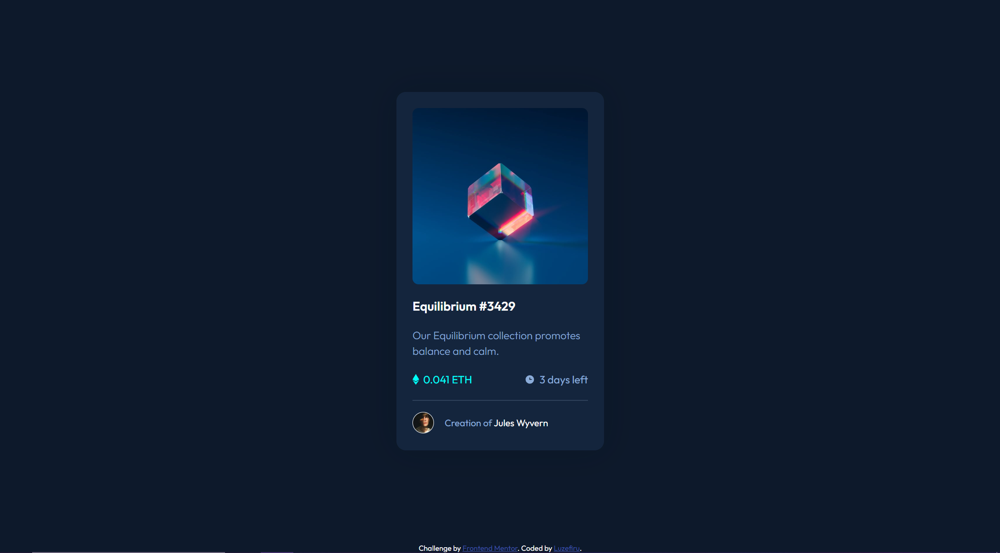

# Frontend Mentor - NFT preview card component solution

This is a solution to the [NFT preview card component challenge on Frontend Mentor](https://www.frontendmentor.io/challenges/nft-preview-card-component-SbdUL_w0U). Frontend Mentor challenges help you improve your coding skills by building realistic projects. 

## Table of contents

- [Overview](#overview)
  - [The challenge](#the-challenge)
  - [Screenshot](#screenshot)
  - [Links](#links)
- [My process](#my-process)
  - [Built with](#built-with)
  - [What I learned](#what-i-learned)
  - [Continued development](#continued-development)
- [Author](#author)

**Note: Delete this note and update the table of contents based on what sections you keep.**

## Overview

### The challenge

Users should be able to:

- View the optimal layout depending on their device's screen size
- See hover states for interactive elements

### Screenshot



### Links

- Solution URL: [Add solution URL here](https://your-solution-url.com)
- Live Site URL: [Add live site URL here](https://your-live-site-url.com)

## My process

### Built with

- Semantic HTML5 markup
- CSS custom properties
- Flexbox
- CSS Grid
- CSS Pseudo-elements

### What I learned

I can achieve a `background-image` "overlay" effect using the `::after` and `::before` Pseudo-elements. This makes a nice effect when the user hovers over the image.

```CSS
.card__img {
  background-image: url(images/image-equilibrium.jpg);
  background-repeat: no-repeat;
  background-size: cover;
  border-radius: 9px;
  background-position: center;
  cursor: pointer;
}

.card__img:hover::after {
  content: '';
  position: absolute;
  background-color: hsla(178, 100%, 50%, 0.5);
  height: 16.4rem;
  width: 16.4rem;
  border-radius: 9px;
}

.card__img:hover::before {
  content: '';
  position: absolute;
  background: url(./images/icon-view.svg) no-repeat;
  background-size: 50px 50px;
  height: 16.4rem;
  width: 16.4rem;
  background-position: center;
}
```

### Continued development

I should give explicit sizes to my images if I plan to do the Pseudo-element overlay trick because I'm constantly hardcoding values insetad of making them responsive based on the image.

## Author

- Github - [Luzefiru](https://github.com/Luzefiru)
- Frontend Mentor - [@Luzefiru](https://www.frontendmentor.io/profile/Luzefiru)